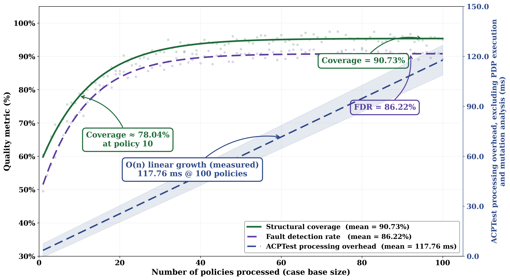

# ACPTest — Adaptive Case-based Policy Testing

> Combining **Case-Based Reasoning (CBR)** and **Reinforcement Learning (Q-learning)**
> for efficient, reuse-driven access-control policy testing.



## Key Results (R = 30 runs)

| Configuration | Coverage | Fault Detection | Test Cases | Redundancy |
|---|---|---|---|---|
| From-scratch | 51.55 ± 1.11 % | 36.95 ± 1.61 % | 36.75 ± 0.59 | 37.66 ± 0.63 % |
| CBR only | 83.26 ± 1.50 % | 71.98 ± 1.74 % | 20.45 ± 0.31 | 22.50 ± 0.46 % |
| RL only | 76.10 ± 1.09 % | 64.13 ± 1.69 % | 28.33 ± 0.37 | 32.25 ± 0.60 % |
| **CBR + RL (ACPTest)** | **90.73 ± 1.18 %** | **86.22 ± 1.14 %** | **21.04 ± 0.25** | **4.19 ± 0.22 %** |

## Quick Start

```bash
git clone https://github.com/cuong-nguyenvan/ACPTest.git
cd ACPTest
python -m venv .venv && source .venv/bin/activate
pip install -r requirements.txt              # core (5 packages)
pip install -r requirements-dev.txt          # + pytest, matplotlib, seaborn
pip install -r requirements-optional.txt     # + z3, scikit-learn (optional)

# Run the Hospital Information System case study
bash scripts/run_case_study.sh

# Reproduce all 30 × 4 experiments
bash scripts/run_all.sh
```

## Repository Structure

```
ACPTest/
├── README.md                      ← You are here
├── REPRODUCIBILITY.md             ← Full technical specification
├── CASE_STUDY.md                  ← Hospital Information System walkthrough
├── requirements.txt               ← Runtime dependencies (5 packages)
├── requirements-dev.txt           ← Test + plotting (pytest, matplotlib, seaborn)
├── requirements-optional.txt      ← Optional (z3-solver, scikit-learn, etc.)
├── LICENSE                        ← MIT License
├── .gitignore
│
├── src/                           ← Source code
│   ├── __init__.py
│   ├── runner.py                  ← Experiment orchestrator
│   ├── cbr/                       ← Case-Based Reasoning engine
│   │   ├── __init__.py
│   │   ├── similarity.py          ← Weighted heterogeneous distance
│   │   ├── retrieval.py           ← k-NN retrieval with tie-breaking
│   │   ├── adaptation.py          ← Test-case adaptation operators
│   │   └── case_base.py           ← Case-base management & persistence
│   ├── rl/                        ← Reinforcement Learning module
│   │   ├── __init__.py
│   │   ├── q_learning.py          ← Tabular Q-learning agent
│   │   ├── state.py               ← State discretisation (5-D → bins)
│   │   ├── reward.py              ← Reward function
│   │   └── actions.py             ← Action definitions
│   ├── mutation/                   ← Mutant generation & equivalence
│   │   ├── __init__.py
│   │   ├── operators.py           ← 7 mutation operators
│   │   ├── generator.py           ← First-order mutant generator
│   │   └── equivalence.py         ← 3-stage equivalence pipeline
│   └── policy/                    ← Policy representation & evaluation
│       ├── __init__.py
│       ├── parser.py              ← XACML 3.0 parser
│       ├── evaluator.py           ← Policy evaluation engine
│       └── paths.py               ← Evaluation-path enumeration
│
├── configs/                       ← Experiment configuration
│   ├── experiment.yaml            ← Master config (all parameters)
│   ├── case_study.yaml            ← Case-study overrides
│   └── seeds.txt                  ← 30 random seeds
│
├── data/
│   ├── policies/                  ← Generated policy pool (XACML)
│   ├── case_base_init/            ← Initial case base (5 seed cases)
│   ├── results/                   ← Experiment outputs
│   │   ├── Runs_Raw.csv
│   │   └── tables/                ← Aggregated tables (Table 1–5)
│   └── case_study/                ← MedSafe HIS policies & mutants
│       ├── medsafe_root.xml       ← Full XACML (v1.0, 27 rules)
│       ├── medsafe_v1.1.xml
│       ├── medsafe_v1.2.xml
│       ├── case_base_42.json
│       ├── mutants/
│       └── expected_results/
│
├── scripts/                       ← Reproduction & analysis scripts
│   ├── run_all.sh                 ← Full reproduction (30 × 4)
│   ├── run_case_study.sh          ← MedSafe case study
│   ├── gen_mutants.sh             ← Generate mutant pool
│   └── analyse.py                 ← Post-hoc analysis & table generation
│
├── tests/                         ← Unit tests
│   ├── test_similarity.py
│   ├── test_q_learning.py
│   ├── test_equivalence.py
│   └── test_paths.py
│
└── docs/
    └── figures/
        └── Chart_Panel.png        ← Main results chart
```

## Documentation

| Document | Description |
|---|---|
| **[docs/EXPERIMENTS.md](docs/EXPERIMENTS.md)** | **Experimental procedure and reproduction guide** — environment setup, execution of all three experiments, result aggregation, validation, troubleshooting, and customisation |
| [REPRODUCIBILITY.md](REPRODUCIBILITY.md) | Similarity weights, normalisation, path enumeration, Q-learning discretisation, equivalent-mutant detection, seeds, and full run configuration |
| [CASE_STUDY.md](CASE_STUDY.md) | End-to-end walkthrough on a realistic 27-rule Hospital Information System policy suite |

## Citation

```bibtex
@article{nguyen2026acptest,
  title   = {ACPTest: Adaptive Case-Based Policy Testing with
             Reinforcement Learning},
  author  = {Nguyen, Cuong Van},
  year    = {2026}
}
```

## License

This project is licensed under the MIT License — see [LICENSE](LICENSE) for details.
